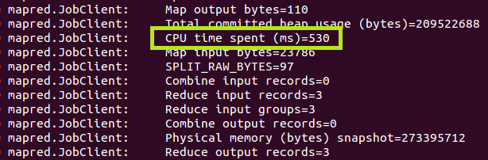
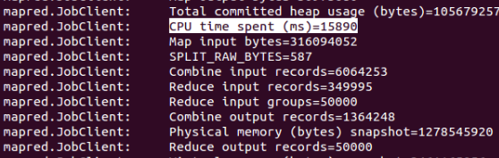
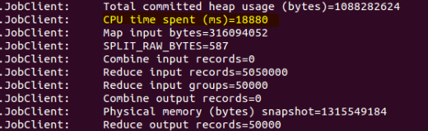
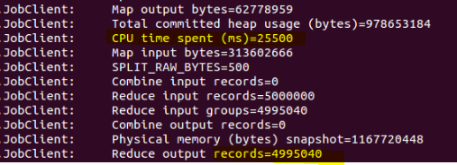
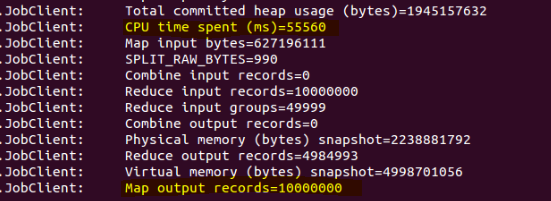
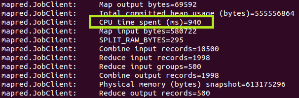
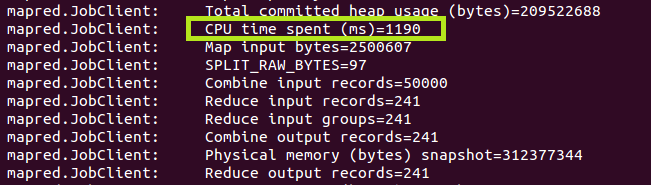
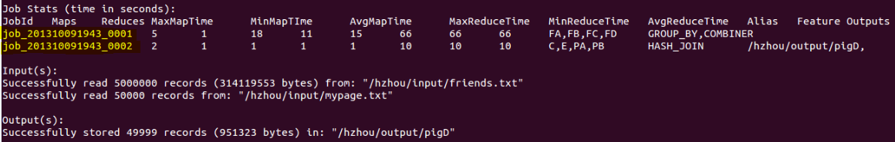
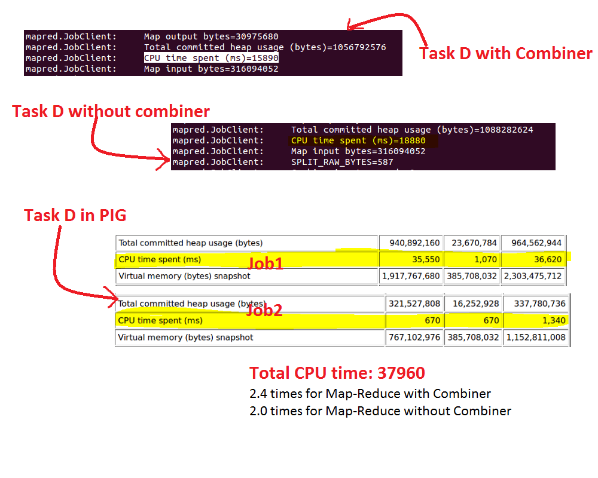

<h1 align="center">Report for Project1</h1>
##Workload assignment:    
**Ying Wang**:Task A, H(Two version of Task H)    
**Salah** : Task B, C, G (Task H)   
**Hao**(know something about Hadoop): Task  D, E, F, Pig A, B, D (also a different version of task C)

##Task Description:
###Task A:
1.	We can use only one map for the function    
2.	**Mapper** output: `<ID,name+hobby>`
Because we just need to list the name and hobby of a certain nationality, we don’t need a combiner to do extra job. It’s better that we make the task simple.
3.	ScreenShot without reducer:      

###Task B:
**Problem Description:**
Write a job that reports for each country, how many of its citizens have a Facebook page.
**Solution:**
It was fairly a very easy problem. I needed only to process the MyPage dataset, since it contain information of all the users along with their nationality. I used one job containing one mapper and one reducer. I have also tested the processing using the reducer as a Combiner.
**Mapper**:
Input: the MyPage dataset
Output: Country Name and a count of one for each citizen.
**Reducer**:****
Reducer aggregates the counts for each country and outputs a single record for each country.
Output: Country Name and total # of citizens having a page.
**Task B Execution without using a Combiner:**
<pre>

ubuntu@ubuntu-VirtualBox:~/wpi/cs525/Project1$ hadoop jar taskB.jar taskB /cs525/bigdata /cs525/bigtaskBout
13/10/10 04:31:01 WARN mapred.JobClient: Use GenericOptionsParser for parsing the arguments. Applications should implement Tool for the same.
13/10/10 04:31:01 INFO util.NativeCodeLoader: Loaded the native-hadoop library
13/10/10 04:31:01 WARN snappy.LoadSnappy: Snappy native library not loaded
13/10/10 04:31:01 INFO mapred.FileInputFormat: Total input paths to process : 1
13/10/10 04:31:01 INFO mapred.JobClient: Running job: job_201310051810_0021
13/10/10 04:31:02 INFO mapred.JobClient:  map 0% reduce 0%
13/10/10 04:31:06 INFO mapred.JobClient:  map 100% reduce 0%
13/10/10 04:31:13 INFO mapred.JobClient:  map 100% reduce 11%
13/10/10 04:31:14 INFO mapred.JobClient:  map 100% reduce 55%
13/10/10 04:31:15 INFO mapred.JobClient:  map 100% reduce 100%
13/10/10 04:31:16 INFO mapred.JobClient: Job complete: job_201310051810_0021
13/10/10 04:31:16 INFO mapred.JobClient: Counters: 30
13/10/10 04:31:16 INFO mapred.JobClient:   Job Counters 
13/10/10 04:31:16 INFO mapred.JobClient:     Launched reduce tasks=3
13/10/10 04:31:16 INFO mapred.JobClient:     SLOTS_MILLIS_MAPS=4147
13/10/10 04:31:16 INFO mapred.JobClient:     Total time spent by all reduces waiting after reserving slots (ms)=0
13/10/10 04:31:16 INFO mapred.JobClient:     Total time spent by all maps waiting after reserving slots (ms)=0
13/10/10 04:31:16 INFO mapred.JobClient:     Launched map tasks=1
13/10/10 04:31:16 INFO mapred.JobClient:     Data-local map tasks=1
13/10/10 04:31:16 INFO mapred.JobClient:     SLOTS_MILLIS_REDUCES=26545
13/10/10 04:31:16 INFO mapred.JobClient:   File Input Format Counters 
13/10/10 04:31:16 INFO mapred.JobClient:     Bytes Read=2504380
13/10/10 04:31:16 INFO mapred.JobClient:   File Output Format Counters 
13/10/10 04:31:16 INFO mapred.JobClient:     Bytes Written=3713
13/10/10 04:31:16 INFO mapred.JobClient:   FileSystemCounters
13/10/10 04:31:16 INFO mapred.JobClient:     FILE_BYTES_READ=864636
13/10/10 04:31:16 INFO mapred.JobClient:     HDFS_BYTES_READ=2504479
13/10/10 04:31:16 INFO mapred.JobClient:     FILE_BYTES_WRITTEN=1825479
13/10/10 04:31:16 INFO mapred.JobClient:     HDFS_BYTES_WRITTEN=3713
13/10/10 04:31:16 INFO mapred.JobClient:   Map-Reduce Framework
13/10/10 04:31:16 INFO mapred.JobClient:     Map output materialized bytes=864636
13/10/10 04:31:16 INFO mapred.JobClient:     Map input records=50000
13/10/10 04:31:16 INFO mapred.JobClient:     Reduce shuffle bytes=864636
13/10/10 04:31:16 INFO mapred.JobClient:     Spilled Records=100000
13/10/10 04:31:16 INFO mapred.JobClient:     Map output bytes=764618
13/10/10 04:31:16 INFO mapred.JobClient:     Total committed heap usage (bytes)=446627840
13/10/10 04:31:16 INFO mapred.JobClient:     CPU time spent (ms)=4590
13/10/10 04:31:16 INFO mapred.JobClient:     Map input bytes=2504380
13/10/10 04:31:16 INFO mapred.JobClient:     SPLIT_RAW_BYTES=99
13/10/10 04:31:16 INFO mapred.JobClient:     Combine input records=0
13/10/10 04:31:16 INFO mapred.JobClient:     Reduce input records=50000
13/10/10 04:31:16 INFO mapred.JobClient:     Reduce input groups=242
13/10/10 04:31:16 INFO mapred.JobClient:     Combine output records=0
13/10/10 04:31:16 INFO mapred.JobClient:     Physical memory (bytes) snapshot=432398336
13/10/10 04:31:16 INFO mapred.JobClient:     Reduce output records=242
13/10/10 04:31:16 INFO mapred.JobClient:     Virtual memory (bytes) snapshot=1891098624
13/10/10 04:31:16 INFO mapred.JobClient:     Map output records=50000
</pre>
This was an easy task of managing only 50000 records, so the very little CPU time (4590ms) was spent.
**Task B Execution with a Combiner:**
<pre>
ubuntu@ubuntu-VirtualBox:~/wpi/cs525/MapReduceQueries$ hadoop jar taskB.jar taskB /cs525/bigdata /cs525/bigtaskBout2
13/10/10 14:52:27 WARN mapred.JobClient: Use GenericOptionsParser for parsing the arguments. Applications should implement Tool for the same.
13/10/10 14:52:28 INFO util.NativeCodeLoader: Loaded the native-hadoop library
13/10/10 14:52:28 WARN snappy.LoadSnappy: Snappy native library not loaded
13/10/10 14:52:28 INFO mapred.FileInputFormat: Total input paths to process : 1
13/10/10 14:52:28 INFO mapred.JobClient: Running job: job_201310051810_0039
13/10/10 14:52:29 INFO mapred.JobClient:  map 0% reduce 0%
13/10/10 14:52:34 INFO mapred.JobClient:  map 100% reduce 0%
13/10/10 14:52:42 INFO mapred.JobClient:  map 100% reduce 22%
13/10/10 14:52:43 INFO mapred.JobClient:  map 100% reduce 55%
13/10/10 14:52:43 INFO mapred.JobClient: Job complete: job_201310051810_0039
13/10/10 14:52:43 INFO mapred.JobClient: Counters: 30
13/10/10 14:52:43 INFO mapred.JobClient:   Job Counters 
13/10/10 14:52:43 INFO mapred.JobClient:     Launched reduce tasks=3
13/10/10 14:52:43 INFO mapred.JobClient:     SLOTS_MILLIS_MAPS=3477
13/10/10 14:52:43 INFO mapred.JobClient:     Total time spent by all reduces waiting after reserving slots (ms)=0
13/10/10 14:52:43 INFO mapred.JobClient:     Total time spent by all maps waiting after reserving slots (ms)=0
13/10/10 14:52:43 INFO mapred.JobClient:     Launched map tasks=1
13/10/10 14:52:43 INFO mapred.JobClient:     Data-local map tasks=1
13/10/10 14:52:43 INFO mapred.JobClient:     SLOTS_MILLIS_REDUCES=26215
13/10/10 14:52:43 INFO mapred.JobClient:   File Input Format Counters 
13/10/10 14:52:43 INFO mapred.JobClient:     Bytes Read=2504380
13/10/10 14:52:43 INFO mapred.JobClient:   File Output Format Counters 
13/10/10 14:52:43 INFO mapred.JobClient:     Bytes Written=3713
13/10/10 14:52:43 INFO mapred.JobClient:   FileSystemCounters
13/10/10 14:52:43 INFO mapred.JobClient:     FILE_BYTES_READ=4215
13/10/10 14:52:43 INFO mapred.JobClient:     HDFS_BYTES_READ=2504479
13/10/10 14:52:43 INFO mapred.JobClient:     FILE_BYTES_WRITTEN=104973
13/10/10 14:52:43 INFO mapred.JobClient:     HDFS_BYTES_WRITTEN=3713
13/10/10 14:52:43 INFO mapred.JobClient:   Map-Reduce Framework
13/10/10 14:52:43 INFO mapred.JobClient:     Map output materialized bytes=4215
13/10/10 14:52:43 INFO mapred.JobClient:     Map input records=50000
13/10/10 14:52:43 INFO mapred.JobClient:     Reduce shuffle bytes=4215
13/10/10 14:52:43 INFO mapred.JobClient:     Spilled Records=484
13/10/10 14:52:43 INFO mapred.JobClient:     Map output bytes=764618
13/10/10 14:52:43 INFO mapred.JobClient:     Total committed heap usage (bytes)=335413248
13/10/10 14:52:43 INFO mapred.JobClient:     CPU time spent (ms)=3270
13/10/10 14:52:43 INFO mapred.JobClient:     Map input bytes=2504380
13/10/10 14:52:43 INFO mapred.JobClient:     SPLIT_RAW_BYTES=99
13/10/10 14:52:43 INFO mapred.JobClient:     Combine input records=50000
13/10/10 14:52:43 INFO mapred.JobClient:     Reduce input records=242
13/10/10 14:52:43 INFO mapred.JobClient:     Reduce input groups=242
13/10/10 14:52:43 INFO mapred.JobClient:     Combine output records=242
13/10/10 14:52:43 INFO mapred.JobClient:     Physical memory (bytes) snapshot=375631872
13/10/10 14:52:43 INFO mapred.JobClient:     Reduce output records=242
13/10/10 14:52:43 INFO mapred.JobClient:     Virtual memory (bytes) snapshot=1885925376
13/10/10 14:52:43 INFO mapred.JobClient:     Map output records=50000
</pre>
The CPU time spent while using a combiner was even smaller of only 3270ms.
**Discussion**:
The interesting thing about this is that we could avoid the use of a separate reducer, because the size of the dataset was so small that only one mapper can easily handle that. So a mapper side reducer would be sufficient to produce the desired output. But, in general if the input dataset size is so huge and if a single mapper cannot handle that, we must use a reducer to aggregate the counts. Moreover, in hadoop if we specify to use a combiner, but do not specify a reducer, the combiner is never calls by the Hadoop system, with the assumption that combiner only helps reducers and if there is  no reducer there is no need to use combiner.

###Task C:
**Problem Description:**
Find the top 10 interesting facebook pages, namely, those that got the most accesses based on the AccessLog dataset compared to all other pages.
**Solution:**
It was a very tricky problem. Getting the cumulative counts for every page accesses was very easy task, which involves only aggregating the inputs received from the mapper. Since it asked to find the top 10, it requires some sorting to be performed. The easiest solution would be to use the output of the reducer to go through another map-reduce job for sorting, and produce the top 10 elements. But that easy solution would waste resources making the whole thing very inefficient. So to find the top 10 pages, I have implemented a sorting for 10 elements inside the reducer function. This sorting of only 10 elements would hardly consume any resource. Since we sorted inside the reducer the reducer does not produce any output, we left the work of outputting only 10 records to the cleanup() method of the reducer class. So as a whole we accomplished the task very fast using only one job containing one mapper and one reducer.
**Mapper: **
Input: AccessLog dataset
Output:  ID of the page that was accessed, and a count
**Combiner:**
Aggregated the output of each mapper.
**Reducer:**
Aggregated the total access count for every page that was accessed. Sorted the aggregated counts. The reducer method did not produce any output. Instead, I used the cleanup() method of the reducer class to produce the top 10 pages with their access count.
**Task C Execution without using a Combiner:**
<pre>
ubuntu@ubuntu-VirtualBox:~/wpi/cs525/Project1$ hadoop jar taskC.jar taskC /cs525/bigdata /cs525/bigtaskCout
13/10/10 04:36:20 WARN mapred.JobClient: Use GenericOptionsParser for parsing the arguments. Applications should implement Tool for the same.
13/10/10 04:36:20 INFO input.FileInputFormat: Total input paths to process : 1
13/10/10 04:36:20 INFO util.NativeCodeLoader: Loaded the native-hadoop library
13/10/10 04:36:20 WARN snappy.LoadSnappy: Snappy native library not loaded
13/10/10 04:36:20 INFO mapred.JobClient: Running job: job_201310051810_0022
13/10/10 04:36:21 INFO mapred.JobClient:  map 0% reduce 0%
13/10/10 04:36:27 INFO mapred.JobClient:  map 10% reduce 0%
13/10/10 04:36:32 INFO mapred.JobClient:  map 20% reduce 0%
13/10/10 04:36:34 INFO mapred.JobClient:  map 20% reduce 6%
13/10/10 04:36:36 INFO mapred.JobClient:  map 30% reduce 6%
13/10/10 04:36:42 INFO mapred.JobClient:  map 40% reduce 6%
13/10/10 04:36:44 INFO mapred.JobClient:  map 40% reduce 13%
13/10/10 04:36:45 INFO mapred.JobClient:  map 50% reduce 13%
13/10/10 04:36:58 INFO mapred.JobClient:  map 60% reduce 16%
13/10/10 04:37:01 INFO mapred.JobClient:  map 70% reduce 16%
13/10/10 04:37:07 INFO mapred.JobClient:  map 70% reduce 23%
13/10/10 04:37:08 INFO mapred.JobClient:  map 75% reduce 23%
13/10/10 04:37:11 INFO mapred.JobClient:  map 77% reduce 23%
13/10/10 04:37:14 INFO mapred.JobClient:  map 78% reduce 23%
13/10/10 04:37:18 INFO mapred.JobClient:  map 79% reduce 23%
13/10/10 04:37:20 INFO mapred.JobClient:  map 80% reduce 23%
13/10/10 04:37:34 INFO mapred.JobClient:  map 90% reduce 23%
13/10/10 04:37:40 INFO mapred.JobClient:  map 100% reduce 26%
13/10/10 04:37:47 INFO mapred.JobClient:  map 100% reduce 30%
13/10/10 04:37:51 INFO mapred.JobClient:  map 100% reduce 33%
13/10/10 04:38:07 INFO mapred.JobClient:  map 100% reduce 100%
13/10/10 04:38:07 INFO mapred.JobClient: Job complete: job_201310051810_0022
13/10/10 04:38:07 INFO mapred.JobClient: Counters: 29
13/10/10 04:38:07 INFO mapred.JobClient:   Job Counters 
13/10/10 04:38:07 INFO mapred.JobClient:     Launched reduce tasks=1
13/10/10 04:38:07 INFO mapred.JobClient:     SLOTS_MILLIS_MAPS=77663
13/10/10 04:38:07 INFO mapred.JobClient:     Total time spent by all reduces waiting after reserving slots (ms)=0
13/10/10 04:38:07 INFO mapred.JobClient:     Total time spent by all maps waiting after reserving slots (ms)=0
13/10/10 04:38:07 INFO mapred.JobClient:     Launched map tasks=10
13/10/10 04:38:07 INFO mapred.JobClient:     Data-local map tasks=10
13/10/10 04:38:07 INFO mapred.JobClient:     SLOTS_MILLIS_REDUCES=100058
13/10/10 04:38:07 INFO mapred.JobClient:   File Output Format Counters 
13/10/10 04:38:07 INFO mapred.JobClient:     Bytes Written=99
13/10/10 04:38:07 INFO mapred.JobClient:   FileSystemCounters
13/10/10 04:38:07 INFO mapred.JobClient:     FILE_BYTES_READ=200000294
13/10/10 04:38:07 INFO mapred.JobClient:     HDFS_BYTES_READ=634491089
13/10/10 04:38:07 INFO mapred.JobClient:     FILE_BYTES_WRITTEN=300264037
13/10/10 04:38:07 INFO mapred.JobClient:     HDFS_BYTES_WRITTEN=99
13/10/10 04:38:07 INFO mapred.JobClient:   File Input Format Counters 
13/10/10 04:38:07 INFO mapred.JobClient:     Bytes Read=634489949
13/10/10 04:38:07 INFO mapred.JobClient:   Map-Reduce Framework
13/10/10 04:38:07 INFO mapred.JobClient:     Map output materialized bytes=100000060
13/10/10 04:38:07 INFO mapred.JobClient:     Map input records=10000000
13/10/10 04:38:07 INFO mapred.JobClient:     Reduce shuffle bytes=100000060
13/10/10 04:38:07 INFO mapred.JobClient:     Spilled Records=30000000
13/10/10 04:38:07 INFO mapred.JobClient:     Map output bytes=80000000
13/10/10 04:38:07 INFO mapred.JobClient:     Total committed heap usage (bytes)=2167013376
13/10/10 04:38:07 INFO mapred.JobClient:     CPU time spent (ms)=42110
13/10/10 04:38:07 INFO mapred.JobClient:     Combine input records=0
13/10/10 04:38:07 INFO mapred.JobClient:     SPLIT_RAW_BYTES=1140
13/10/10 04:38:07 INFO mapred.JobClient:     Reduce input records=10000000
13/10/10 04:38:07 INFO mapred.JobClient:     Reduce input groups=50000
13/10/10 04:38:07 INFO mapred.JobClient:     Combine output records=0
13/10/10 04:38:07 INFO mapred.JobClient:     Physical memory (bytes) snapshot=2436706304
13/10/10 04:38:07 INFO mapred.JobClient:     Reduce output records=10
13/10/10 04:38:07 INFO mapred.JobClient:     Virtual memory (bytes) snapshot=5232447488
13/10/10 04:38:07 INFO mapred.JobClient:     Map output records=10000000  
</pre>
From the above screen we that 10 mappers were used. It took 42110 ms to produce output without using a combiner. The reducer produced 10 records which is certainly the top 10 pages with their counts.
**Task C Execution with a Combiner:**
<pre>
ubuntu@ubuntu-VirtualBox:~/wpi/cs525/MapReduceQueries$ hadoop jar taskC.jar taskC /cs525/bigdata /cs525/bigtaskCout2
13/10/10 16:01:52 WARN mapred.JobClient: Use GenericOptionsParser for parsing the arguments. Applications should implement Tool for the same.
13/10/10 16:01:52 INFO input.FileInputFormat: Total input paths to process : 1
13/10/10 16:01:52 INFO util.NativeCodeLoader: Loaded the native-hadoop library
13/10/10 16:01:52 WARN snappy.LoadSnappy: Snappy native library not loaded
13/10/10 16:01:53 INFO mapred.JobClient: Running job: job_201310051810_0043
13/10/10 16:01:54 INFO mapred.JobClient:  map 0% reduce 0%
13/10/10 16:02:00 INFO mapred.JobClient:  map 10% reduce 0%
13/10/10 16:02:03 INFO mapred.JobClient:  map 20% reduce 0%
13/10/10 16:02:06 INFO mapred.JobClient:  map 30% reduce 0%
13/10/10 16:02:07 INFO mapred.JobClient:  map 30% reduce 6%
13/10/10 16:02:09 INFO mapred.JobClient:  map 40% reduce 6%
13/10/10 16:02:12 INFO mapred.JobClient:  map 50% reduce 6%
13/10/10 16:02:15 INFO mapred.JobClient:  map 60% reduce 6%
13/10/10 16:02:16 INFO mapred.JobClient:  map 60% reduce 13%
13/10/10 16:02:19 INFO mapred.JobClient:  map 70% reduce 13%
13/10/10 16:02:22 INFO mapred.JobClient:  map 80% reduce 23%
13/10/10 16:02:25 INFO mapred.JobClient:  map 90% reduce 23%
13/10/10 16:02:27 INFO mapred.JobClient:  map 100% reduce 23%
13/10/10 16:02:31 INFO mapred.JobClient:  map 100% reduce 30%
13/10/10 16:02:34 INFO mapred.JobClient:  map 100% reduce 100%
13/10/10 16:02:34 INFO mapred.JobClient: Job complete: job_201310051810_0043
13/10/10 16:02:34 INFO mapred.JobClient: Counters: 29
13/10/10 16:02:34 INFO mapred.JobClient:   Job Counters 
13/10/10 16:02:34 INFO mapred.JobClient:     Launched reduce tasks=1
13/10/10 16:02:34 INFO mapred.JobClient:     SLOTS_MILLIS_MAPS=30934
13/10/10 16:02:34 INFO mapred.JobClient:     Total time spent by all reduces waiting after reserving slots (ms)=0
13/10/10 16:02:34 INFO mapred.JobClient:     Total time spent by all maps waiting after reserving slots (ms)=0
13/10/10 16:02:34 INFO mapred.JobClient:     Launched map tasks=10
13/10/10 16:02:34 INFO mapred.JobClient:     Data-local map tasks=10
13/10/10 16:02:34 INFO mapred.JobClient:     SLOTS_MILLIS_REDUCES=33971
13/10/10 16:02:34 INFO mapred.JobClient:   File Output Format Counters 
13/10/10 16:02:34 INFO mapred.JobClient:     Bytes Written=99
13/10/10 16:02:34 INFO mapred.JobClient:   FileSystemCounters
13/10/10 16:02:34 INFO mapred.JobClient:     FILE_BYTES_READ=25261078
13/10/10 16:02:34 INFO mapred.JobClient:     HDFS_BYTES_READ=634506710
13/10/10 16:02:34 INFO mapred.JobClient:     FILE_BYTES_WRITTEN=31014339
13/10/10 16:02:34 INFO mapred.JobClient:     HDFS_BYTES_WRITTEN=99
13/10/10 16:02:34 INFO mapred.JobClient:   File Input Format Counters 
13/10/10 16:02:34 INFO mapred.JobClient:     Bytes Read=634505570
13/10/10 16:02:34 INFO mapred.JobClient:   Map-Reduce Framework
13/10/10 16:02:34 INFO mapred.JobClient:     Map output materialized bytes=5488610
13/10/10 16:02:34 INFO mapred.JobClient:     Map input records=10000000
13/10/10 16:02:34 INFO mapred.JobClient:     Reduce shuffle bytes=5488610
13/10/10 16:02:34 INFO mapred.JobClient:     Spilled Records=3074934
13/10/10 16:02:34 INFO mapred.JobClient:     Map output bytes=80000000
13/10/10 16:02:34 INFO mapred.JobClient:     Total committed heap usage (bytes)=2139488256
13/10/10 16:02:34 INFO mapred.JobClient:     CPU time spent (ms)=33650
13/10/10 16:02:34 INFO mapred.JobClient:     Combine input records=11878369
13/10/10 16:02:34 INFO mapred.JobClient:     SPLIT_RAW_BYTES=1140
13/10/10 16:02:34 INFO mapred.JobClient:     Reduce input records=548855
13/10/10 16:02:34 INFO mapred.JobClient:     Reduce input groups=50000
13/10/10 16:02:34 INFO mapred.JobClient:     Combine output records=2427224
13/10/10 16:02:34 INFO mapred.JobClient:     Physical memory (bytes) snapshot=2391830528
13/10/10 16:02:34 INFO mapred.JobClient:     Reduce output records=10
13/10/10 16:02:34 INFO mapred.JobClient:     Virtual memory (bytes) snapshot=5239975936
13/10/10 16:02:34 INFO mapred.JobClient:     Map output records=10000000  
</pre>
**Discussion**:
Using a combiner we can see that the time spent was 33650 ms, which is 20% less time than the time spent for the job without using a reducer.
**Output File:**
[http://70.36.96.44:50198/browseBlock.jsp?blockId=-5671906843933697599&blockSize=99&genstamp=2199&filename=%2Fcs525%2FbigtaskCout%2Fpart-r-00000&datanodePort=50294&namenodeInfoPort=50139](http://70.36.96.44:50198/browseBlock.jsp?blockId=-5671906843933697599&blockSize=99&genstamp=2199&filename=%2Fcs525%2FbigtaskCout%2Fpart-r-00000&datanodePort=50294&namenodeInfoPort=50139)

###Task D:
1. One map-reduce job with combiner    
2. **Mapper** output: for accesslog table -> `<personalID, '1'>`; for mypage table -> `<personalID, name>`     
   **Combiner** output: for accesslog table -> `<personalID, 'localAccessCount'>`; for mypage table -> `<personalID, name>`    
   **Reducer** output: `<name, 'globalAccessCount'>`
3. ScreenShot with Combiner:      
   

4. ScreenShot without Combiner:      
   
5. **Conclusion**: Combiner makes the program faster, as it reduce the workload of reducers[But when I use a small dataset(500 records in mypage.txt),with combiner will cost more time than without combiner].     

###Task E:
1. Two map-reduce job with combiner    
2. *Job1*->:   
   **Mapper** output:  `<personID (byWho) + pageID (WhatPage), ' '>`        
   **Reducer** output: `<' ', personID + CountOfVaulues)>`      
   *Job2*->:   
   **Mapper** output: `<personID, CountOfVaulues>`     
   **Reducer** output: `<personID,'totalAccess' + 'distinctPageAmount'>`
3. ScreenShot:      
   
4. **Conclusion**: Understand the role of KEY, then the whole task will be easy.

###Task F:
1. One map-reduce job with combiner    
2. **Mapper** output: for friends table -> `<personalID, 'F'+myFriend>`; for accesslog table -> `<Whatpage, 'A'+ByWho>`       
   **Reducer** output: `<personalID, 'FriendIDWhoNeverAccessMyPage'>`    
3. ScreenShot:      
   

###Task G:
**Problem Description:**
Find the list of all people that have set up a facebook page, but have lost interest, i.e., after some initial time unit (say 10 days or whatever you choose) have never accessed facebook again (meaning no entries in the facebook AccessLog exist after that date.
**Solution: **
For this task we needed 2 datasets. To process the two datasets we used two separate mappers. In each mapper we used a different Tag to identify and join the records at the reducer.
**Mapper 1:**
	MypageMap: mapper to map mypage.txt
	Outputs: ID , M, Name
	M is a tag to identify at the reducer that the input came from mypage.txt
**Mapper 2:**
	AccessLogMap: mapper to map accesslog.txt
	Outputs: ID , A, AccessTime
	A is a tag to identify at the reducer that the input came from accesslog.txt
**Reducer:**
Here is the logic to find the uninterested people: people whose initial access time and last access time differed only by the threshold number of days ( 10*24*60= 14400 minutes, assuming that each each access time unit is a minute). If the difference of last access time and first access time is within threshold time of 10 days and the difference between current time and last access time is greater than the threshold time of 10 days, then they used facebook only for the initial threshold period and never accessed again. The difference between current time and last access time is taken into consideration because we should not judge people who started using facebook in last 10 days.
Reducer Output: MemberID, Member Name, first access time, last access time
**Task G Execution:**
<pre>
ubuntu@ubuntu-VirtualBox:~/wpi/cs525/Project1$ hadoop jar taskG.jar taskG  /cs525/bigdata /cs525/bigtaskGout
13/10/10 04:51:28 WARN mapred.JobClient: Use GenericOptionsParser for parsing the arguments. Applications should implement Tool for the same.
13/10/10 04:51:28 INFO util.NativeCodeLoader: Loaded the native-hadoop library
13/10/10 04:51:28 WARN snappy.LoadSnappy: Snappy native library not loaded
13/10/10 04:51:28 INFO mapred.FileInputFormat: Total input paths to process : 1
13/10/10 04:51:28 INFO mapred.FileInputFormat: Total input paths to process : 1
13/10/10 04:51:28 INFO mapred.JobClient: Running job: job_201310051810_0023
13/10/10 04:51:29 INFO mapred.JobClient:  map 0% reduce 0%
13/10/10 04:51:39 INFO mapred.JobClient:  map 9% reduce 0%
13/10/10 04:51:45 INFO mapred.JobClient:  map 18% reduce 0%
13/10/10 04:51:48 INFO mapred.JobClient:  map 18% reduce 6%
13/10/10 04:51:53 INFO mapred.JobClient:  map 27% reduce 6%
13/10/10 04:51:59 INFO mapred.JobClient:  map 36% reduce 6%
13/10/10 04:52:02 INFO mapred.JobClient:  map 36% reduce 11%
13/10/10 04:52:04 INFO mapred.JobClient:  map 45% reduce 11%
13/10/10 04:52:09 INFO mapred.JobClient:  map 54% reduce 12%
13/10/10 04:52:12 INFO mapred.JobClient:  map 54% reduce 16%
13/10/10 04:52:17 INFO mapred.JobClient:  map 63% reduce 18%
13/10/10 04:52:25 INFO mapred.JobClient:  map 72% reduce 18%
13/10/10 04:52:26 INFO mapred.JobClient:  map 72% reduce 21%
13/10/10 04:52:31 INFO mapred.JobClient:  map 81% reduce 21%
13/10/10 04:52:33 INFO mapred.JobClient:  map 90% reduce 23%
13/10/10 04:52:35 INFO mapred.JobClient:  map 100% reduce 24%
13/10/10 04:52:46 INFO mapred.JobClient:  map 100% reduce 33%
13/10/10 04:54:00 INFO mapred.JobClient:  map 100% reduce 44%
13/10/10 04:54:03 INFO mapred.JobClient:  map 100% reduce 66%
13/10/10 04:54:14 INFO mapred.JobClient:  map 100% reduce 77%
13/10/10 04:54:31 INFO mapred.JobClient:  map 100% reduce 99%
13/10/10 04:54:32 INFO mapred.JobClient:  map 100% reduce 100%
13/10/10 04:54:33 INFO mapred.JobClient: Job complete: job_201310051810_0023
13/10/10 04:54:33 INFO mapred.JobClient: Counters: 29
13/10/10 04:54:33 INFO mapred.JobClient:   Job Counters 
13/10/10 04:54:33 INFO mapred.JobClient:     Launched reduce tasks=3
13/10/10 04:54:33 INFO mapred.JobClient:     SLOTS_MILLIS_MAPS=63106
13/10/10 04:54:33 INFO mapred.JobClient:     Total time spent by all reduces waiting after reserving slots (ms)=0
13/10/10 04:54:33 INFO mapred.JobClient:     Total time spent by all maps waiting after reserving slots (ms)=0
13/10/10 04:54:33 INFO mapred.JobClient:     Launched map tasks=11
13/10/10 04:54:33 INFO mapred.JobClient:     Data-local map tasks=11
13/10/10 04:54:33 INFO mapred.JobClient:     SLOTS_MILLIS_REDUCES=518603
13/10/10 04:54:33 INFO mapred.JobClient:   File Input Format Counters 
13/10/10 04:54:33 INFO mapred.JobClient:     Bytes Read=0
13/10/10 04:54:33 INFO mapred.JobClient:   File Output Format Counters 
13/10/10 04:54:33 INFO mapred.JobClient:     Bytes Written=0
13/10/10 04:54:33 INFO mapred.JobClient:   FileSystemCounters
13/10/10 04:54:33 INFO mapred.JobClient:     FILE_BYTES_READ=301092539
13/10/10 04:54:33 INFO mapred.JobClient:     HDFS_BYTES_READ=636996611
13/10/10 04:54:33 INFO mapred.JobClient:     FILE_BYTES_WRITTEN=449365473
13/10/10 04:54:33 INFO mapred.JobClient:   Map-Reduce Framework
13/10/10 04:54:33 INFO mapred.JobClient:     Map output materialized bytes=150066417
13/10/10 04:54:33 INFO mapred.JobClient:     Map input records=10050000
13/10/10 04:54:33 INFO mapred.JobClient:     Reduce shuffle bytes=150066417
13/10/10 04:54:33 INFO mapred.JobClient:     Spilled Records=30100000
13/10/10 04:54:33 INFO mapred.JobClient:     Map output bytes=129966219
13/10/10 04:54:33 INFO mapred.JobClient:     Total committed heap usage (bytes)=2631270400
13/10/10 04:54:33 INFO mapred.JobClient:     CPU time spent (ms)=55840
13/10/10 04:54:33 INFO mapred.JobClient:     Map input bytes=635814681
13/10/10 04:54:33 INFO mapred.JobClient:     SPLIT_RAW_BYTES=2282
13/10/10 04:54:33 INFO mapred.JobClient:     Combine input records=0
13/10/10 04:54:33 INFO mapred.JobClient:     Reduce input records=10050000
13/10/10 04:54:33 INFO mapred.JobClient:     Reduce input groups=50000
13/10/10 04:54:33 INFO mapred.JobClient:     Combine output records=0
13/10/10 04:54:33 INFO mapred.JobClient:     Physical memory (bytes) snapshot=2914086912
13/10/10 04:54:33 INFO mapred.JobClient:     Reduce output records=0
13/10/10 04:54:33 INFO mapred.JobClient:     Virtual memory (bytes) snapshot=6597853184
13/10/10 04:54:33 INFO mapred.JobClient:     Map output records=10050000
</pre>
From the above statistics, we can see that the time spent for the job is 55840 ms. 11 mappers were used and 3 reducers were used. We did not use any combiner because we needed to find the max and min of the access time and we needed to join two different types of datasets. Here we can also see that the reducer did not produce any record, which is indicating that in our dataset there were no such users who lost interest. I have tested the work with several big datasets produced randomly. In every case for the big datasets, there was no output since in the larger datasets the map-reduce job did not find any user who has lost interest. So to check the code we produced a small dataset and hand edited some values so that some users must fall within the criteria that they used facebook only for a initial period of 10 days. That time my code produced correct result. So, I conclude that it can surely find the users who have lost interest.

###Task H:
**TaskH describe 1[Ying]:**
We can check the number of a certain person’s friends, and the visiting number of it. It’s a problem that we connect all the three forms together using the ID and return information in each of the forms. The connection of each forms is the personal ID.     
1.	We use a map and a reducer for the function       
2.	Mapper output: for mypage table ->`<ID,name >`;for friends table`<ID,”F”>`;for accesslog table->`<ID,”A”>`;     
3.	Reducer output:`<name,countToBeFriendOfOthers>`    
4.	ScreenShot with reducer:       
 

**TaskI describe 2[Ying]:**
We can check the number of a certain nationality, how many person are in that nationality, we can use map to find the nationality and use reduce to count for each nationality. Then we can get how many people are in the facebook with the same nationality.     
1.	We use a map and a reducer for the function    
2.	Mapper output: for mypage table ->`< nationality,’1’ >`;    
3.	 Reducer output:`<key,countToBenationality>`;    
4.	ScreenShot with reducer:      
   
 
**TaskH describe 3[Salah]:**
**Problem Description:**
Design advanced data analysis task of your own choosing. You need to explain in English what it accomplishes and why it might be a useful task. Then develop the map-reduce solution for it.
**Solution: **
I have searched internet and several books to find out the popular queries that the real facebook does in a regular basis. I found that they need to make a query which finds the geographical distribution of the people who accessed page of their particular advertiser. Advertisers need that information to fine tune their business and marketing strategies for the geographic regions of the world. For the sake of simplicity we assumed that the advertiser is also has facebook page and people around the world access that. So the **problem statement in English** would be:
	`“Find the geographical distribution of facebook users who accessed a certain facebook page. The job should print the Country name and percentage of users from that country who have accessed a particular facebook page, i.e., the advertiser’s page.”`
**The solution to the designed problem:**
For this task we needed 2 datasets. To process the two datasets we used two separate mappers. In each mapper we used a different Tag to identify and join the records at the reducer.
**Mapper 1:**
>MypageMap: mapper to map mypage.txt
>Outputs: ID , M, Country Name
>M is a tag to identify at the reducer that the input came from mypage.txt  

**Mapper 2:**
>AccessLogMap: mapper to map accesslog.txt
>Outputs: ID , A, 1
>A is a tag to identify at the reducer that the input came from accesslog.txt

**Reducer:**
The reduce function is calculating the total hits of a page and inserting the pageid and count in an associative array. Since we need total number of access to calculate the percentage of users in a particular country we are actually using country name as the key of the associative array and we are incrementing the value once for each unique user. The reducer does not output anything to the output file. Instead I used the cleanup method of the reducer class to output the country names and percent of users to the advertiser's page.
Reducer output: Country Name and  Percent of Users from that country
**Task H Execution:**
<pre>
ubuntu@ubuntu-VirtualBox:~/wpi/cs525/Project1$ hadoop jar taskH.jar taskH  /cs525/bigdata /cs525/bigtaskHout 5555
13/10/10 05:37:13 WARN mapred.JobClient: Use GenericOptionsParser for parsing the arguments. Applications should implement Tool for the same.
13/10/10 05:37:13 INFO input.FileInputFormat: Total input paths to process : 1
13/10/10 05:37:13 INFO util.NativeCodeLoader: Loaded the native-hadoop library
13/10/10 05:37:13 WARN snappy.LoadSnappy: Snappy native library not loaded
13/10/10 05:37:13 INFO input.FileInputFormat: Total input paths to process : 1
13/10/10 05:37:13 INFO mapred.JobClient: Running job: job_201310051810_0029
13/10/10 05:37:14 INFO mapred.JobClient:  map 0% reduce 0%
13/10/10 05:37:18 INFO mapred.JobClient:  map 9% reduce 0%
13/10/10 05:37:20 INFO mapred.JobClient:  map 18% reduce 0%
13/10/10 05:37:23 INFO mapred.JobClient:  map 27% reduce 0%
13/10/10 05:37:25 INFO mapred.JobClient:  map 36% reduce 0%
13/10/10 05:37:26 INFO mapred.JobClient:  map 36% reduce 9%
13/10/10 05:37:27 INFO mapred.JobClient:  map 45% reduce 9%
13/10/10 05:37:29 INFO mapred.JobClient:  map 54% reduce 9%
13/10/10 05:37:31 INFO mapred.JobClient:  map 63% reduce 9%
13/10/10 05:37:33 INFO mapred.JobClient:  map 72% reduce 9%
13/10/10 05:37:35 INFO mapred.JobClient:  map 81% reduce 18%
13/10/10 05:37:36 INFO mapred.JobClient:  map 90% reduce 18%
13/10/10 05:37:37 INFO mapred.JobClient:  map 100% reduce 18%
13/10/10 05:37:41 INFO mapred.JobClient:  map 100% reduce 33%
13/10/10 05:37:42 INFO mapred.JobClient:  map 100% reduce 100%
13/10/10 05:37:43 INFO mapred.JobClient: Job complete: job_201310051810_0029
13/10/10 05:37:43 INFO mapred.JobClient: Counters: 29
13/10/10 05:37:43 INFO mapred.JobClient:   Job Counters 
13/10/10 05:37:43 INFO mapred.JobClient:     Launched reduce tasks=1
13/10/10 05:37:43 INFO mapred.JobClient:     SLOTS_MILLIS_MAPS=21351
13/10/10 05:37:43 INFO mapred.JobClient:     Total time spent by all reduces waiting after reserving slots (ms)=0
13/10/10 05:37:43 INFO mapred.JobClient:     Total time spent by all maps waiting after reserving slots (ms)=0
13/10/10 05:37:43 INFO mapred.JobClient:     Launched map tasks=11
13/10/10 05:37:43 INFO mapred.JobClient:     Data-local map tasks=11
13/10/10 05:37:43 INFO mapred.JobClient:     SLOTS_MILLIS_REDUCES=23742
13/10/10 05:37:43 INFO mapred.JobClient:   File Output Format Counters 
13/10/10 05:37:43 INFO mapred.JobClient:     Bytes Written=2067
13/10/10 05:37:43 INFO mapred.JobClient:   FileSystemCounters
13/10/10 05:37:43 INFO mapred.JobClient:     FILE_BYTES_READ=966358
13/10/10 05:37:43 INFO mapred.JobClient:     HDFS_BYTES_READ=636996985
13/10/10 05:37:43 INFO mapred.JobClient:     FILE_BYTES_WRITTEN=2228678
13/10/10 05:37:43 INFO mapred.JobClient:     HDFS_BYTES_WRITTEN=2067
13/10/10 05:37:43 INFO mapred.JobClient:   File Input Format Counters 
13/10/10 05:37:43 INFO mapred.JobClient:     Bytes Read=0
13/10/10 05:37:43 INFO mapred.JobClient:   Map-Reduce Framework
13/10/10 05:37:43 INFO mapred.JobClient:     Map output materialized bytes=966418
13/10/10 05:37:43 INFO mapred.JobClient:     Map input records=10050000
13/10/10 05:37:43 INFO mapred.JobClient:     Reduce shuffle bytes=966418
13/10/10 05:37:43 INFO mapred.JobClient:     Spilled Records=100348
13/10/10 05:37:43 INFO mapred.JobClient:     Map output bytes=866004
13/10/10 05:37:43 INFO mapred.JobClient:     Total committed heap usage (bytes)=2315780096
13/10/10 05:37:43 INFO mapred.JobClient:     CPU time spent (ms)=21610
13/10/10 05:37:43 INFO mapred.JobClient:     Combine input records=0
13/10/10 05:37:43 INFO mapred.JobClient:     SPLIT_RAW_BYTES=2656
13/10/10 05:37:43 INFO mapred.JobClient:     Reduce input records=50174
13/10/10 05:37:43 INFO mapred.JobClient:     Reduce input groups=49999
13/10/10 05:37:43 INFO mapred.JobClient:     Combine output records=0
13/10/10 05:37:43 INFO mapred.JobClient:     Physical memory (bytes) snapshot=2566696960
13/10/10 05:37:43 INFO mapred.JobClient:     Reduce output records=127
13/10/10 05:37:43 INFO mapred.JobClient:     Virtual memory (bytes) snapshot=5685473280
13/10/10 05:37:43 INFO mapred.JobClient:     Map output records=50174
</pre>
**Discussion:**
From the above statistics, we can see that the time spent for the job is 21610 ms. 11 mappers were used and 1 reducer was used. In the program we explicitly specified to use one reducer because we needed to find  the total number of user in the whole world, and calculate the percent of users in a country using that total. The equation is (country-total x 100/world-total). We did not use any combiner because we needed to find the total count in the whole world and we needed to join two different types of datasets. Here we can also see that the reducer produced 127 record, which is indicating that the advertiser (ID 5555) has fans in 127 countries.
**Output files:**
[http://70.36.96.44:50198/browseBlock.jsp?blockId=6318510005230177040&blockSize=2067&genstamp=2281&filename=%2Fcs525%2FbigtaskHout%2Fpart-r-00000&datanodePort=50294&namenodeInfoPort=50139](http://70.36.96.44:50198/browseBlock.jsp?blockId=6318510005230177040&blockSize=2067&genstamp=2281&filename=%2Fcs525%2FbigtaskHout%2Fpart-r-00000&datanodePort=50294&namenodeInfoPort=50139)

##Comparison:
###Task D -> Map-Reduce VS Pig
1. *Job Count*:   
   In **map-reduce**, everything can be done in one job.    
   In **Pig**, the same work needs two jobs.     
   
2. *CPU Time*:
   
3. **Conclusion**: Pig is high language for Hadoop, and it is not as efficient as Map-reduce in Java. 
