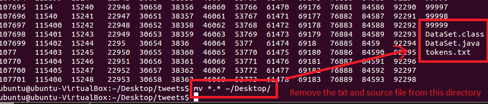
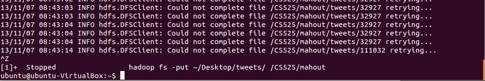

##Something about this task
1. Find more information about this project here: [http://web.cs.wpi.edu/~cs525/f13b-EAR//cs525-homepage/projects/project2-cs525b-fall2013.pdf](http://web.cs.wpi.edu/~cs525/f13b-EAR//cs525-homepage/projects/project2-cs525b-fall2013.pdf)     
2. Most of my operation are found from here: [https://cwiki.apache.org/confluence/display/MAHOUT/Quick+tour+of+text+analysis+using+the+Mahout+command+line](https://cwiki.apache.org/confluence/display/MAHOUT/Quick+tour+of+text+analysis+using+the+Mahout+command+line)    

##How to run this task
###Step 1. Generate the DataSet
1. Compile & Run [DataSet.java](https://github.com/zhouhao/CS525-Big-Data-Course-Project/blob/master/Project2/task1/DataSetGenerator/DataSet.java)
2. Now, you get a file list of 119848 tweets(one tweet one file) [it seems too many].   
3. A tricky here: as there are too many files in that folder, it is hard to open it. But before we upload the folder to HDFS, we must remove the txt, and source files from it.      

###Step 2. Upload these files into HDFS 
1. First, we create a directory in HDFS using: `hadoop fs -mkdir -p /CS525/mahout`    
2. Now, we use this command to upload the tweets files: `hadoop fs -put ~/Desktop/tweets /CS525/mahout`   

###Step 3. Convert Text to Mahout Sequence files
	mahout seqdirectory \
		-c UTF-8 \
		-i /CS525/mahout/tweets/ \
		-o /CS525/mahout/seqfiles
***Note:This step is time-consuming, and it costs me about half an hour, which makes me thought Hadoop is down***

###Step 4. Generate tf-idf Vectors from Sequence files
	mahout seq2sparse \
	   -i /CS525/mahout/seqfiles/ \
	   -o /CS525/mahout/vectors/ \
	   -ow -chunk 100 \
	   -x 90 \
	   -seq \
	   -ml 50 \
	   -n 2 \
	   -nv

###Step 5. Generate Kmeans Cluster from vectors
	mahout kmeans \
	   -i /CS525/mahout/vectors/tfidf-vectors/ \
	   -c /CS525/mahout/kmeans-centroids \
	   -cl \
	   -o /CS525/mahout/kmeans-clusters \
	   -k 20 \
	   -ow \
	   -x 10 \
	   -dm org.apache.mahout.common.distance.CosineDistanceMeasure

###Step 6. Examine the clusters 
	mahout clusterdump \
	   -d /CS525/mahout/vectors/dictionary.file-0 \
	   -dt sequencefile \
	   -i /CS525/mahout/kmeans-clusters/clusters-1-final \
	   -n 20 \
	   -b 100 \
	   -o clusterDump.txt \
	   -p /CS525/mahout/kmeans-clusters/clusteredPoints/ 
***Note      
1. : `clusterDump.txt` is in you local file system***, you can find it in your current directory where you run this command       
2. `-i /CS525/mahout/kmeans-clusters/clusters-1-final \`, the number in `clusters-X-final` may be changed, just check the HDFS.     

------
Error when uploading files to HDFS:    
     
**Find more about this bug report by others**:https://issues.apache.org/jira/browse/HDFS-148
