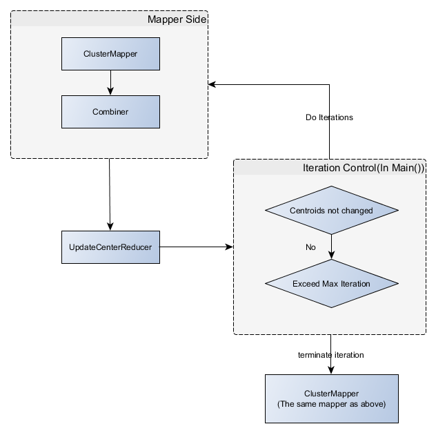

<del>It is almost done. But with small bugs to be fixed. -- 11/08/2013</del>    
**This may be helpful** : [How to configure Hadoop develop environment in Eclipse](http://sbzhouhao.net/2013/11/Configure-Hadoop-develop-environment-in-Eclipse/)       

