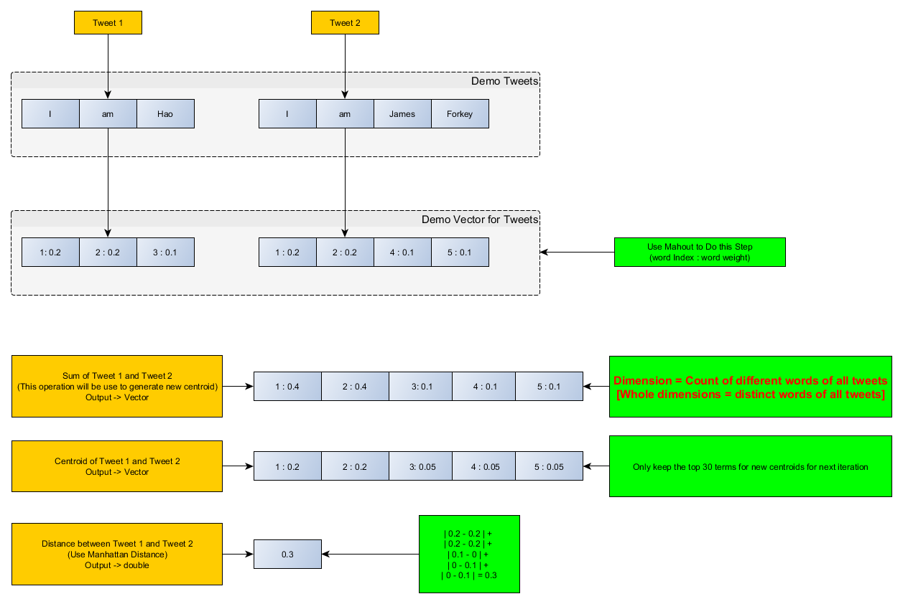
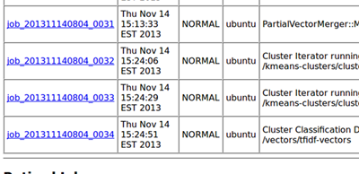
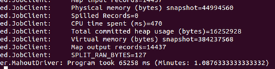

####Task 3 is almost done.

1. I do cluster for 14439 tweets    
2. Do not care whether the centroid is changed between 2 iteration, instead, always use new centroids for next iteration. Therefore, the program just stop after MAX-ITERATION.[It doesn't make sense to judge whether a centroid is changed by THRESHOLD, as different size of datasets have different THRESHOLD]    
3. Keep top 30 terms for each new centroid, which will be used in next iteration       
4. I just run 2 iterations in my current program, but it is pretty fast [in 15 minutes].     

###What to do next
1. Make combiner more robust     
2. <del>Generate top 10 terms for each cluster -- Not so hard (in different MapReduce Job)</del>  
3. <del>Run on more iterations</del>    
4. <del>Compare with Mahout </del>  
###How it works    
   
###Report
**1). MapReduce**:    

1. **9** iterations -- The output for each iteration is the **new centroids**(My mistake, I should run 10 iterations)   
 **[start at 13:38:57 ~ end at 13:52:34] = 13 minutes 37 seconds**     

		CPU Time 1: 69670         
		CPU Time 2: 75660     
		CPU Time 3: 77180     
		CPU Time 4: 76380     
		CPU Time 5: 77490     
		CPU Time 6: 77170     
		CPU Time 7: 78300     
		CPU Time 8: 77340     
		CPU Time 9: 77940        
		
2. **Final output of Clusters with its tweets** -- map only    
 **[start at 13:52:34 ~ end at 13:52:42] = 8 seconds**       
 
		CPU Time: 3670    

3. **Descriptors**: The output of top 10 terms for each cluster is [here](https://github.com/zhouhao/CS525-Big-Data-Course-Project/blob/master/Project2/task3-Comparison/output/topTerm-10-MapReduce.txt)
    
**2). Mahout for the same task**    
        
   

	mahout kmeans \
	  -i /task4/vectors/tfidf-vectors/ \
	  -c /task4/kmeans-centroids \
	  -cl \
	  -o /task4/kmeans-clusters \
	  -k 10 \
	  -ow \
	  -x 9 \
	  -dm org.apache.mahout.common.distance.CosineDistanceMeasure

From above, we see that even we set the iteration time to 9, Mahout finished Cluster job in 3 iterations. And the time it used is about 1 minutes, which is far shorter than our MapReduce job.    
   
I think the reason is that Mahout is professional at Recommendation (include clustering), which beats ours.    

 

